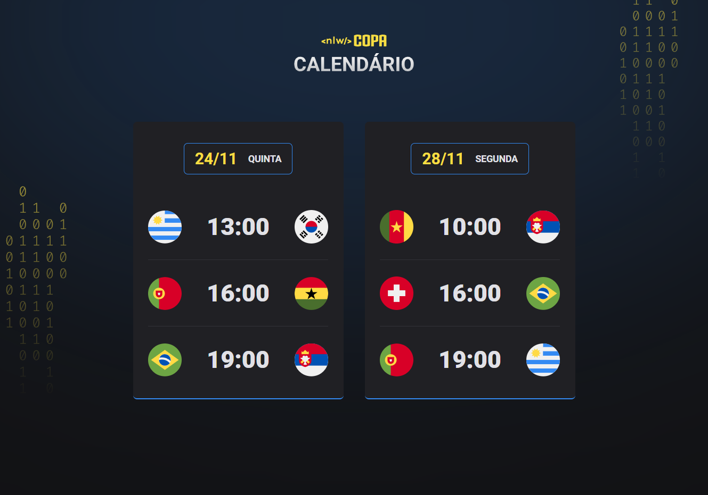

<h1 align="center"> Nlw-Copa #2022</h1>

Projeto desenvolvido para o evento Next Level Week (NLW) da Rocketseat.

  <a href="#-tecnologias">Tecnologias</a>&nbsp;&nbsp;&nbsp;|&nbsp;&nbsp;&nbsp;
  <a href="#-projeto">Projeto</a>&nbsp;&nbsp;&nbsp;|&nbsp;&nbsp;&nbsp;
  <a href="#-layout">Layout</a>&nbsp;&nbsp;&nbsp;|&nbsp;&nbsp;&nbsp;
  <a href="#memo-licença">Licença</a>

  

 

  

## 🚀 Tecnologias

Esse projeto foi desenvolvido com as seguintes tecnologias:

- HTML e CSS
- JavaScript
- Git e Github
- Figma

## 💻 Projeto

O "WorldCup-Calendar" é um projeto que mostra os jogos da Copa de 2022, desenvolvido durante o evento NLW da Rocketseat. Você pode acessar o projeto online [CLICANDO AQUI](https://thiagonevesalmeida.github.io/nlw-copa/).

## 🔖 Layout

Você pode visualizar o layout do projeto através [DESSE LINK](https://www.figma.com/file/J1Z33MISC22YZB8wfxiIns/NLW-Copa-Explorer/duplicate). É necessário ter conta no [Figma](https://figma.com) para acessá-lo.

## 📝 Licença

Esse projeto está sob a licença MIT.

## 📨 Contato

thiagonevesdealmeida@gmail.com

[linkedin.com/in/thiagonevesdealmeida](https://www.linkedin.com/in/thiagonevesdealmeida/)
